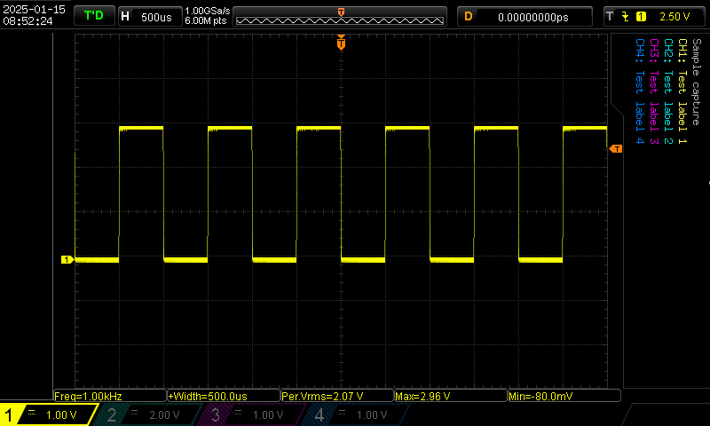

# scope_capture

🔴 This project is still in flux, but as of v0.0.6 it appears to be working quite well.  I will update this README when it goes to v1.0.0, but for now this doc summarizes the basics.

## What it does.

In a nutshell:
- Finds your (RIGOL) scope on the LAN.
- Grabs the current screenshot.
- Blanks the RIGOL logo area and the (irrelevant) "on screen button" areas at the left and right of the image.
- Adds annotations to the (now blank) area on the right:
    - The note you supplied on the command line (`-n`)
    - Any signal names you supplied on the command line (`-l1`, `-l2`, `-l3`, `-l4`).
- Adds an annotation of the current time and date to the (now blank) logo area (upper left corner)
- Saves the capture as `{note}.png` (or, if that file already exists, as `{note}_{number}.png`) with an auto-generated number 2, 3, 4, etc. so that filenames are unique.

I have included a `Sample_capture.png` file in the project.  That output is the result of running `./scope_capture -l1="Test label 1" -l2="Test label 2" -l3="Test label 3" -l4="Test label 4" -n="Sample capture"`



This app has been developed/tested on a DS1054Z, and has been verified with a DS1104Z.  Other RIGOL scopes will probably work, but your mileage may vary.

## PNG checksum correction

In my testing I found tha the DS1104Z scope generated incorrect PNG CRCs, which was causing the PNG library to be unable to load them for annotation.  For that reason this app *always* scans the PNG file and replaces the CRCs with corrected CRCs regardless of what CRCs existed there before.  It currently (as of `v0.0.6`) does not report whether the original CRC was incorrect.

In theory, this behavior means that if a corrupt PNG were received from the scope then this app might happily "correct" a CRC which was *legitimately* bad, and then crash when trying to annotate the image.  Perhaps in the future I will limit the CRC auto-correction to specific scope models and/or scope firmware versions, but for now in practice the current implementation is working consistently on all scopes I have access to.

## How to run it

You can see the arguments by running `./scope_capture -help` like this:

```
$ ./scope_capture --help
scope_capture (RIGOL Scope Capture), v0.0.6
Usage of ./scope_capture
scope_capture:
  -d    Enable debug printing.
  -debug
        Enable debug printing.
  -file string
        Optional name of output file
  -host string
        Hostname or IP address of the oscilloscope (Defaults to "169.254.247.73")
  -l1 string
        Channel 1 label
  -l2 string
        Channel 2 label
  -l3 string
        Channel 3 label
  -l4 string
        Channel 4 label
  -label1 string
        Channel 1 label
  -label2 string
        Channel 2 label
  -label3 string
        Channel 3 label
  -label4 string
        Channel 4 label
  -n string
        Note to add to the image
  -note string
        Note to add to the image
  -port int
        Port number of the oscilloscope (Defaults to 5555)
  -version
        Print version and exit.
$
```

Note that many options have two forms (e.g. `-label` and `-l1`)


## User configuration file

The app will look for a configuration file in these two locations, in order, and use the first one it finds (if any):
- `./config.json`
- `~/.config/capture/config.json`

The config file (if you choose to use one) has the format:

```json
{
    "hostname": "169.254.247.73",
    "port": 5555
}
```

The app will look for keys it knows in the config file and use any it finds.  Extra/unknown keys are ignored.

If you specify `-hostname` or `-port` on the command line then those values will override the value(s) read from the config file.

All config value load / override behavior is logged to the console so you can tell what values are being loaded, and from where, and see clearly what values are finally being used to communicate with the scope.

## Example usage:

This will capture the current display, add the note "Sample capture", annotate signal 1 with "Signal 1 Name", and save it to the file `{note}.png`, so `Sample capture.png`.  If you run it again without deleting the original image capture file then it will save as `Sample capture_2.png` etc. (i.e. it won't ever overwrite a previous capture file, but will keep appending numbers to name the filenames unique).

```
$ ./scope_capture -l1="Test label 1" -l2="Test label 2" -l3="Test label 3" -l4="Test label 4" -n="Sample capture"
scope_capture (RIGOL Scope Capture), v0.0.6
hostname:"c10-eric.local" computername:"c10-eric"
Checking for config file at "./config.json"...
    Found. Loading...
        Adopting scope hostname from config file: "169.254.247.73"
        Adopting scope port from config file: 5555
Pinging scope at "169.254.247.73:5555"...
    Ping successful
Instrument ID: "RIGOL TECHNOLOGIES,DS1054Z,DS1ZA221102281,00.04.04.SP4".
Capturing scope screen...
Auto-correcting PNG checksum...
    Checksum corrected.
Wrote raw scope capture to "./scope_captures/raw_scope_capture.png".
Annotating scope capture...
Wrote annotated scope capture to "./scope_captures/RIGOL_TECHNOLOGIES_DS1054Z_DS1ZA221102281_00.04.04.SP4_2025-01-16_19-24-33.png".
```

## How to build it

### For yourself
If you are just building it for yourself you can cd into `/cmd/scope_capture` and run `go get .` and `go build .`.

### For distribution
If you want to build the current version for "all platforms" then you can cd into `/scripts/release` and run `./build.py`.  That script uses the `click` library so if you don't have it you'll also need to run `pip install click` first.  That script is mostly just "for me" right now, so I haven't made any effort to create a `venv` etc. to make it nicely "distributable".

## Thanks
This project is based on the Python scope capture utility  [https://github.com/RoGeorge/DS1054Z_screen_capture](https://github.com/RoGeorge/DS1054Z_screen_capture).  Many thanks!  That project was instrumental in figuring out how to parse the Rigol protocol.