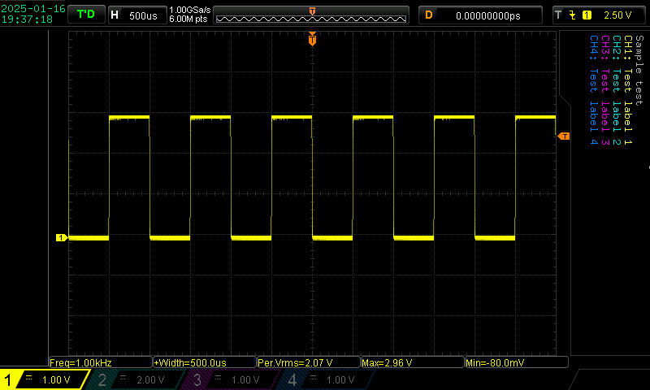

# scope_capture

🔴 This project is still in flux, but as of v0.0.2 it appears to be working quite well.  I will update this README when it goes to v1.0.0, but for now this doc summarizes the basics.

## What it does.

In a nutshell:
- Finds your scope on the LAN.
- Grabs the current screenshot.
- Blanks the RIGOL logo area and the (useless) "on screen button" areas at the left and right of the image.
- Adds annotations to the (now blank) area on the right:
    - The note you supplied on the command line (`-n`)
    - Any signal names you supplied on the command line (`-l1`, `-l2`, `-l3`, `-l4`).
- Adds an annotation of the current time and date to the (now blank) logo area (upper left corner)
- Saves the capture as `{note}.png` (or, if that file already exists, as `{note}_{number}.png`) with an auto-generated number 2, 3, 4, etc. so that filenames are unique.

I have included a `Sample_capture.png` file in the project:



## How to run it

NOTE: 🔴 The default host (IP) of the scope is hard-coded as "169.254.247.73".  I will add support for a config file eventually. For now, if your scope's ip is different, then pass it on the command line.

You can see the arguments by running `./scope_capture -help` like this:

```
$ ./scope_capture --help
Usage of ./scope_capture:
  -d    Enable debug printing.
  -debug
        Enable debug printing.
  -file string
        Optional name of output file
  -host string
        Hostname or IP address of the oscilloscope (default "169.254.247.73")
  -l1 string
        Channel 1 label
  -l2 string
        Channel 2 label
  -l3 string
        Channel 3 label
  -l4 string
        Channel 4 label
  -label1 string
        Channel 1 label
  -label2 string
        Channel 2 label
  -label3 string
        Channel 3 label
  -label4 string
        Channel 4 label
  -n string
        Note to add to the image
  -note string
        Note to add to the image
  -version
        Print version and exit.
$
```

Note that many options have two forms (e.g. `-label` and `-l1`)

## Example usage:

This will capture the current display, add the note "Sample capture", annotate signal 1 with "Signal 1 Name", and save it to the file `{note}.png`, so `Sample capture.png`.  If you run it again without deleting the original image capture file then it will save as `Sample capture_2.png` etc. (i.e. it won't ever overwrite a previous capture file, but will keep appending numbers to name the filenames unique).

```
$ ./scope_capture -l1="Test label 1" -l2="Test label 2" -l3="Test label 3" -l4="Test label 4" -n="Sample capture"
scope_capture (RIGOL Scope Capture), v0.0.2
hostname:"c10-eric.local" computername:"c10-eric"
Pinging "169.254.247.73:5555"...
Ping successful
Instrument ID: "RIGOL TECHNOLOGIES,DS1054Z,DS1ZA221102281,00.04.04.SP4".
Capturing scope screen...
Wrote raw scope capture to "./scope_captures/raw_scope_capture.png".
Annotating scope capture...
Wrote annotated scope capture to "./scope_captures/RIGOL_TECHNOLOGIES_DS1054Z_DS1ZA221102281_00.04.04.SP4_2025-01-15_08-07-32.png".
```

## Thanks
This project is based on the Python scope capture utility  [https://github.com/RoGeorge/DS1054Z_screen_capture](https://github.com/RoGeorge/DS1054Z_screen_capture).  Many thanks!  That project was instrumental in figuring out how to parse the Rigol protocol.